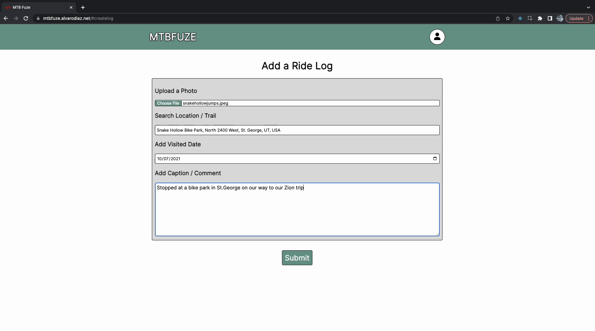
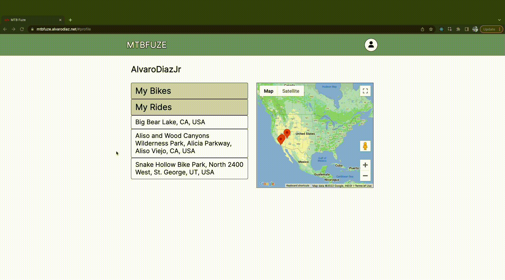

# MTBFuze

A full stack JavaScript solo project for Mountain Bike Riders who want to log places or trails they've ridden at.

## Why I built this

As a somewhat new Mountain Biker I've found a new passion for mountain biking and going out with friends for rides. I wanted to build this app to be able to document and look back at old rides with friends.

## Live Link

Try the application live at https://mtbfuze.alvarodiaz.net/ \
Dummy User
- Username - AlvaroDiazJr
- Password - ad123

## Technologies Used
- HTML
- CSS3
- JavaScript
- Postgresql
- Node.js
- React.js
- Dokku

## Features
- User can create a ride log
- User can add their personal bike to profile
- User can view all ride logs on their profile page
- User can view a map with markers at each ride location
- User can delete their ride log

## Preview




## Stretch Features
- User can edit ride log
- User can tag other riders in ride log


## Getting Started
1. Clone the repository.

    ```shell
    git clone git@github.com:alvarodiazjr/final-project.git
    cd final-project
    ```

1. Install all dependencies with NPM.

    ```shell
    npm install
    ```


1. Create a .env file.

    ```shell
   cp .env.example .env
    ```

1. Postgresql and create database.

    ```shell
    createdb databaseName
    sudo service postgresql start
    pgweb --db=databaseName
    ```

1. Update the DATABASE_URL to your Postgresql database name.

1. Run script to initialize database.

    ```shell
    npm run db:import
    ```

1. Start the project. Once started you can view the application by opening http://localhost:3000 in your browser.

    ```shell
    npm run dev
    ```
